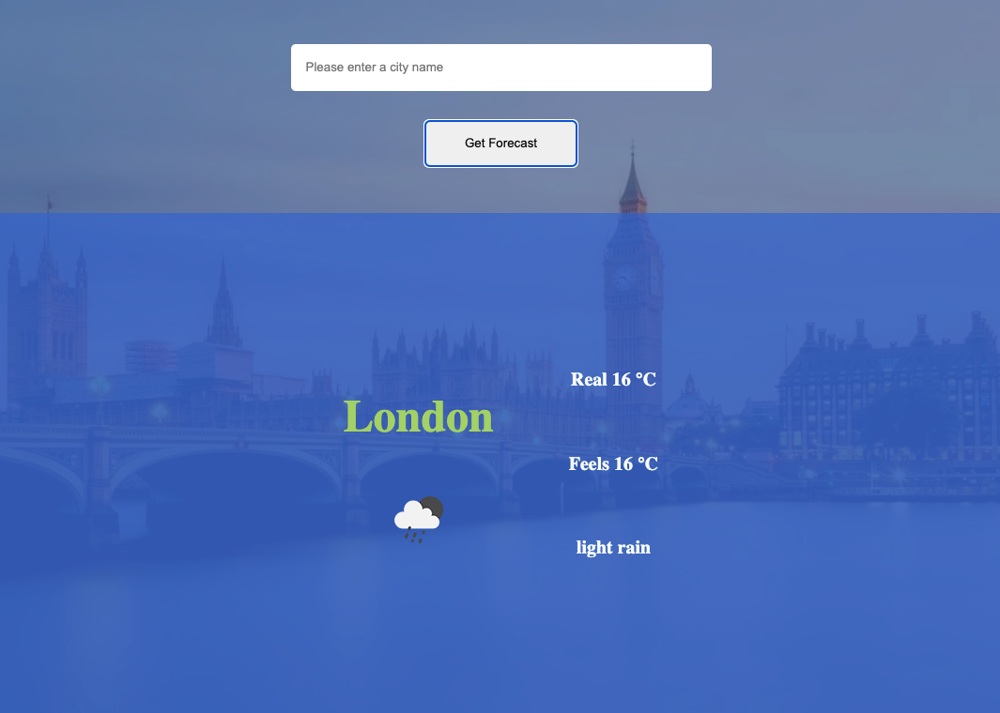
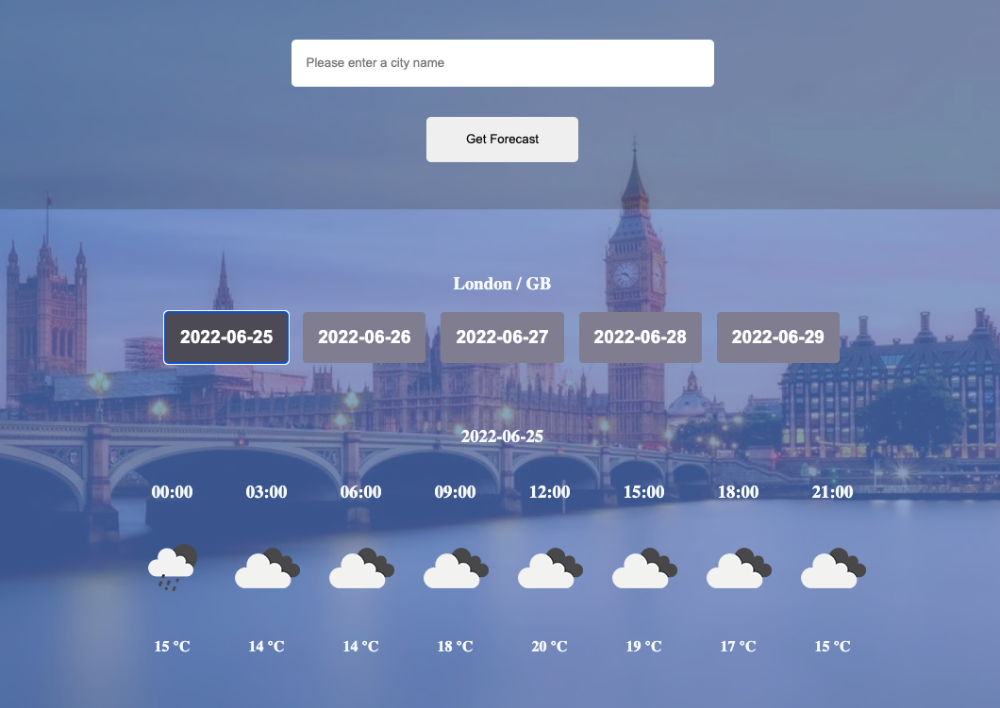

# lookup
[Check it here!](https://lookup-weather.netlify.app)

Simple, React weather application.
---

## How does application works?
1. With loading the landing page, the application get the user's city from user's ip address and show that city's current weather. The app changes background to image of that city.

2. When user enter a city name, the app shows the current weather of the city.
   
   
3. When user enter a city name, the page's background changes to image of that city. If there is no image related to that city, the app searches images related to country code in the image api.

4. When user click the city name, the app shows the detailed forecast of the city for 5 days.
   
   
---

## Used APIs

- openweathermap  --> for weather information
- pexels          --> for background images
- ipgeolocation   --> for the ip of user

---

## Structure
- public
   - assets
   - index.html
- src
   - components
      - DetailForecast.js
      - DetailForecast.module.css
      - MainForecast.js
      - MainForecast.module.css
   - hooks
      - useFetch.js
   - layout
      - Footer.js
      - Footer.module.css
      - Layout.js
      - Navbar.js
      - Navbar.module.css
   - pages
      - DetailPage.js
      - DetailPage.module.css
      - LandingPage.js
      - LandingPage.module.css
      - MainPage.js
      - MainPage.module.css
   - store
      - CityContext.js
      - ErrorAndLoadingContext.js
   - App.js
   - App.css
   - index.js
   - index.css
- package.json
- package-lock.json
- README.md

---

> [See server side](https://github.com/slymny/lookup-server)
